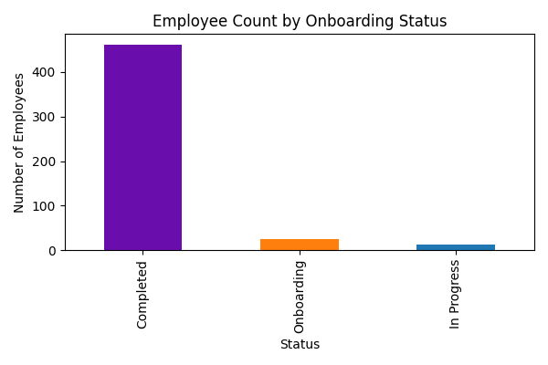
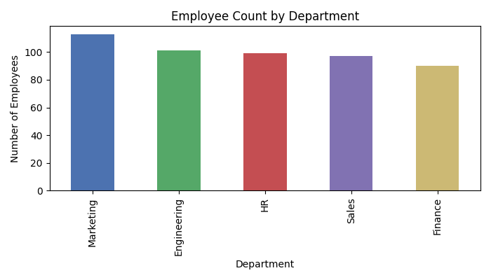
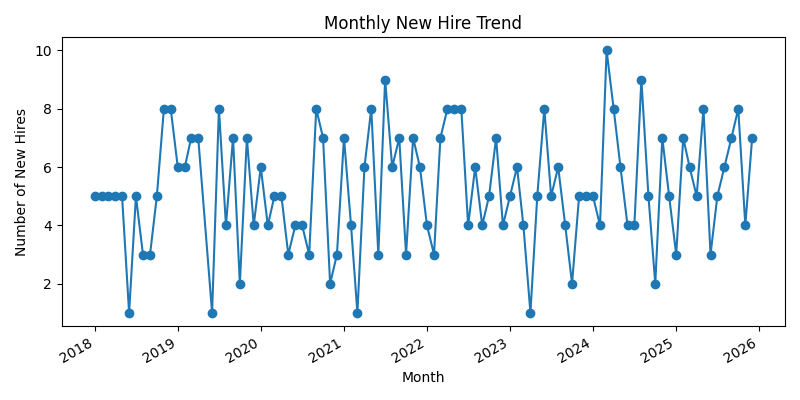

# Employee Onboarding App & Analytics

This project outlines a **full‑fledged employee onboarding solution** built with Power Apps and Power BI.  The goal is to provide HR and managers with a structured way to welcome new hires, track their progress and analyse onboarding performance.  The dataset has been extended to hundreds of employees to simulate a production‑like environment.

## ✨ Points clés / Key points

• **Two experiences:** a canvas app for data entry and process management, and a Power BI report for analytics.

• **KPIs:** number of employees by status (`Onboarding`, `In Progress`, `Completed`), orientation completion rate, document submission rate, average time from start to training completion, monthly hiring trend.

• **Comparisons:** across departments and hiring cohorts to spot bottlenecks and top performers.

• **Cartographie / Visualisations:** interactive maps (for region‑based analysis) can be added if your dataset includes location data; for now the focus is on department, status and time‑based visuals.

• **Storytelling:** dynamic text measures summarising key insights, for example “Onboarding completion rate increased by 10 % compared with last quarter”.

• **Learning focus:** clear data model, documented DAX measures and step‑by‑step instructions for building both the app and the report.

## 🗂 Datasets

Two CSV files are included:

- **`employee_onboarding.csv`** – a small sample of 40 records for quick prototyping.
- **`employee_onboarding_large.csv`** – a realistic dataset with **500 employees** covering start dates from 2018 to 2025.  Each row contains:

  | Column | Description |
  |---|---|
  | `EmployeeID` | Unique identifier (e.g., E0001). |
  | `Name` | Full name of the employee. |
  | `StartDate` | Date the employee started or will start (YYYY‑MM‑DD). |
  | `Position` | Job title. |
  | `Department` | Department (HR, Finance, Engineering, Marketing, Sales). |
  | `Manager` | Name of the manager or supervisor. |
  | `Status` | Onboarding phase (`Onboarding`, `In Progress` or `Completed`). |
  | `OrientationComplete` | Whether the orientation session is complete (`true`/`false`). |
  | `DocumentsSubmitted` | Whether required documents have been submitted (`true`/`false`). |
  | `TrainingCompletionDate` | Date when mandatory training was completed (empty if not yet finished). |
  | `Comments` | Additional notes. |

The larger dataset is generated with random but plausible values and includes employees with future start dates (still in the onboarding phase), which makes it suitable for testing filters and logic.

## 📐 Metrics (aperçu / preview)

- **Employee count by status**: count rows grouped by `Status`.
- **Orientation completion rate**: number of employees with `OrientationComplete = true` ÷ total employees.
- **Document submission rate**: number of employees with `DocumentsSubmitted = true` ÷ total employees.
- **Average onboarding duration (days)**: for completed employees, difference between `StartDate` and `TrainingCompletionDate`.
- **Monthly hiring trend**: number of employees starting each month.

## 🧠 Modèle et fonctionnalités / Model & features

- A **date table** (Year, Month, Quarter) to support time intelligence.
- Calculated columns for department groupings or tenure buckets (e.g., 0–3 months, 3–6 months, >6 months).
- **DAX measures** implementing the KPIs above and dynamic narrative text summarising progress.
- In Power Apps, screens include: home (list of employees with status badges), detail/edit form, new hire form and analytics screen with embedded Power BI tile.

## 🗺️ Feuille de route / Roadmap

- Integrate location‑based data to map where employees are being hired.
- Automate notifications (via Power Automate) when onboarding tasks are overdue.
- Add user roles and security to the app to restrict editing rights.
- Track additional tasks such as equipment requests, account provisioning and mentor assignments.
- Compare onboarding metrics month‑over‑month and year‑over‑year to identify trends.

## ⚠️ Hypothèses & limitations / Assumptions & limitations

- The data is **synthetic** and created for educational purposes; names and dates are randomly generated.
- Status is assigned based on the number of days since the start date (for demonstration only).
- Training completion dates are simulated for employees marked as `Completed`.
- Use this project as a learning template; adapt the logic and visuals to your organisation’s real process.

## 🔧 Stack

**Python (pandas, matplotlib)** for data creation and chart generation, **Power Apps** for the canvas app, **Power Automate** for workflow automation and **Power BI** for reporting.

## 🖼️ Aperçu des tableaux de bord / Dashboard examples

To give you a sense of what the analytics can look like, here are three sample visuals derived from the large dataset:

| Image | Description |
|---|---|
|  | Number of employees in each onboarding phase. |
|  | Distribution of employees across departments. |
|  | New hires per month from 2018–2025.  Peaks and troughs highlight seasonality. |

## 📄 Licence & attributions

All code and documentation in this repository are released under the **MIT License**.  The datasets are synthetic and for demonstration purposes only.  Any logos used in sample visuals remain the property of their respective owners.

## 🙋‍♂️ Contact

Author: **Raju** – [GitHub](https://github.com/saiiii4444)  
If you have questions or contributions, feel free to open an issue or reach out.